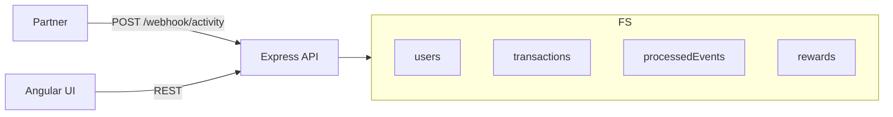
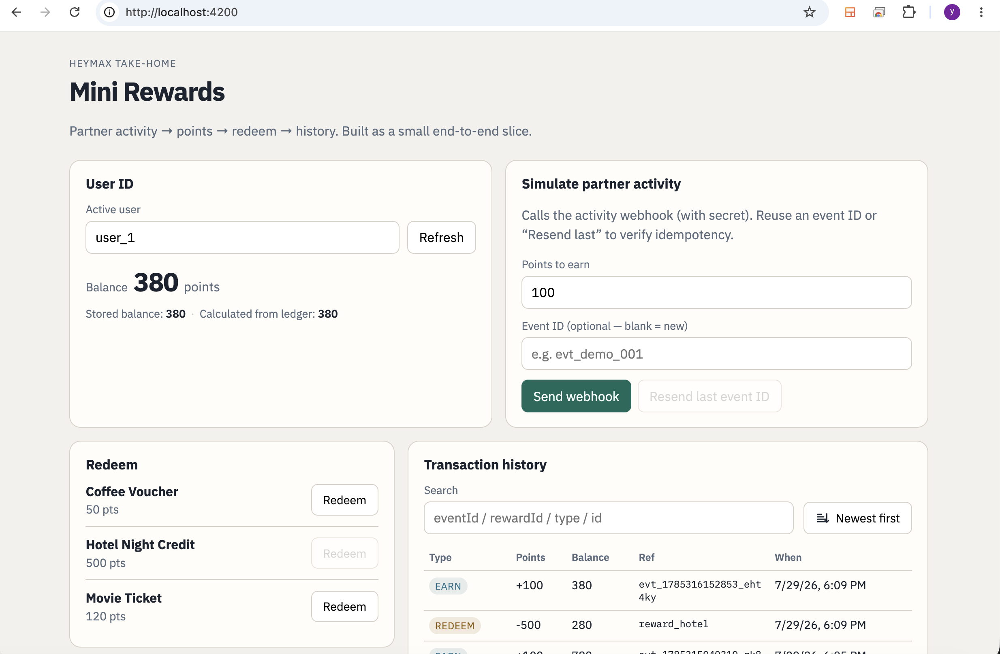

# Mini Rewards — HeyMax take-home

Partner activity webhook → credit points → redeem rewards → view history.

**Stack:** Angular · Express API (deployable as a Cloud Function) · Firestore · Firestore Emulator (runs locally, no cloud project needed).

~4–5 hour scope. I spent the time on ledger correctness and the main user flow rather than polish. See [DECISIONS.md](./DECISIONS.md) for trade-offs.

## Architecture



- Webhook credits are idempotent on `eventId`.
- Balance lives on `users.balance`; `transactions` is the audit trail. Earn and redeem update both in one Firestore transaction.
- The UI only talks to the API — no direct Firestore writes from the client.

## Prerequisites

- Node.js **20+**
- npm

## Setup

```bash
npm install
npm --prefix functions install
npm --prefix web install
npm run build:functions
```

## Run locally

Three terminals, then seed once per emulator session.

| Step | Command | URL |
|------|---------|-----|
| 1. Firestore emulator | `npm run firestore` | http://127.0.0.1:4000 |
| 2. API server | `npm run api` | http://127.0.0.1:3001 |
| 3. Seed rewards | `npm run seed` | — |
| 4. Angular UI | `npm run web` | http://localhost:4200 |

Smoke test (with emulator, API, and seed running):

```bash
npm run demo:curl
```

## Core flow

| Action | UI | API |
|--------|----|-----|
| Earn | Send webhook | `POST /webhook/activity` |
| Balance | Balance card | `GET /users/:userId/balance` |
| Redeem | Reward buttons | `POST /users/:userId/redeem` |
| History | Transaction table | `GET /users/:userId/transactions` |

Default user: `user_1`. Seeded rewards: Coffee Voucher (50), Movie Ticket (120), Hotel Night Credit (500).

## API

Base URL (local): `http://127.0.0.1:3001`

| Method | Path | Notes |
|--------|------|-------|
| `GET` | `/health` | Health check |
| `POST` | `/webhook/activity` | Header: `X-Webhook-Secret: demo-secret` |
| `GET` | `/users/:userId/balance` | Unknown user returns `0` |
| `GET` | `/users/:userId/transactions` | Newest first; `?limit=` up to 200 |
| `POST` | `/users/:userId/redeem` | `{ "rewardId": "reward_coffee" }` |
| `GET` | `/rewards` | Active rewards |

### Webhook example

```bash
curl -X POST http://127.0.0.1:3001/webhook/activity \
  -H "Content-Type: application/json" \
  -H "X-Webhook-Secret: demo-secret" \
  -d '{
    "eventId": "evt_abc123",
    "userId": "user_1",
    "activityType": "purchase",
    "points": 100,
    "partnerId": "partner_demo"
  }'
```

## Testing

Validation unit tests (no emulator):

```bash
npm test
```

**Idempotency:** POST the same `eventId` twice — second response has `"duplicate": true`, balance unchanged. In the UI, click **Resend last event ID**.

**Other cases** (more in [DECISIONS.md](./DECISIONS.md#how-to-verify)):

- Bad webhook secret → `401`
- Invalid points → `400`
- Redeem without enough balance → `409`, no ledger row written
- Unknown reward → `404`

## Project layout

```
mini-rewards/
  functions/          # API + ledger logic
  web/                # Angular UI
  docs/demo.png
  scripts/demo-curl.sh
  DECISIONS.md
```

## Demo


